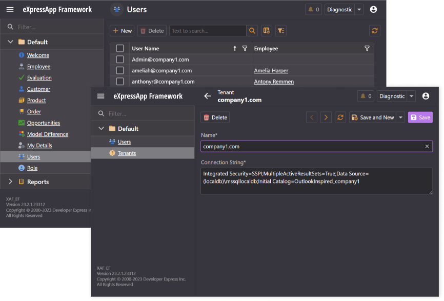

<!-- default badges list -->

<!-- default badges end -->

# XAF - How to Create a Multi-Tenant Application

The Multi-Tenancy Module was first introduced in June 2023 as a Community Technology Preview (CTP). This module helps developers create multi-tenant or SaaS-ready XAF Blazor and WinForms applications (.NET 6+) that target a single database or one database per tenant. To incorporate this capability, you simply need to write a few declarative lines of code instead of writing hundreds of lines of code.

Our v23.2 major update marks the first official release of the DevExpress Multi-Tenancy Module and includes the following features:

- XPO ORM support (v23.1 supported only EF Core).
- Authentication: Log in with an email / AzureAD account, and a password (the domain automatically resolves the tenant and its storage).
- Tenant Isolation: Multi-tenant app with multiple databases (a database per tenant).
- Database Creation: The application automatically creates a tenant database and schema at runtime (if the database does not exist).

## Files to Review

- [OutlookInspired.Blazor.Server/Services/Internal/ApplicationBuilder.cs](./CS/OutlookInspired.Blazor.Server/Services/Internal/ApplicationBuilder.cs)
- [OutlookInspired.Win/Services/ApplicationBuilder.cs](./CS/OutlookInspired.Win/Services/ApplicationBuilder.cs)
- [OutlookInspired.Module/DatabaseUpdate/Updater.cs](./CS/OutlookInspired.Module/DatabaseUpdate/Updater.cs)
