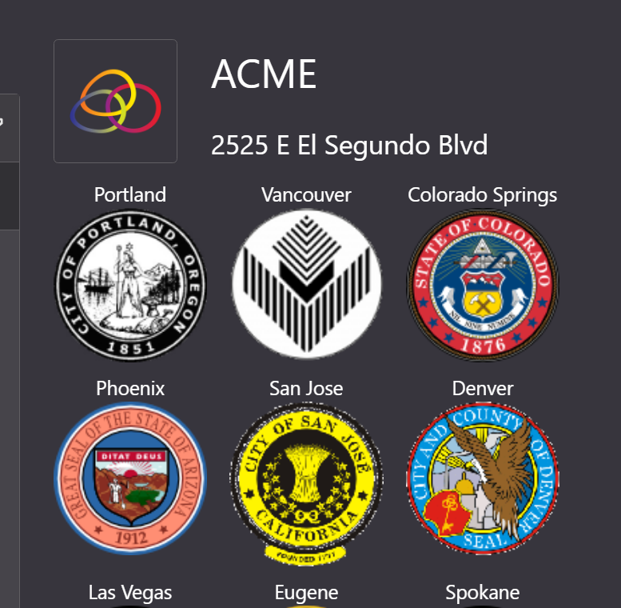
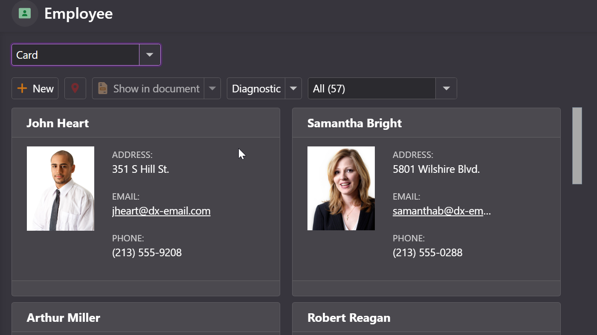
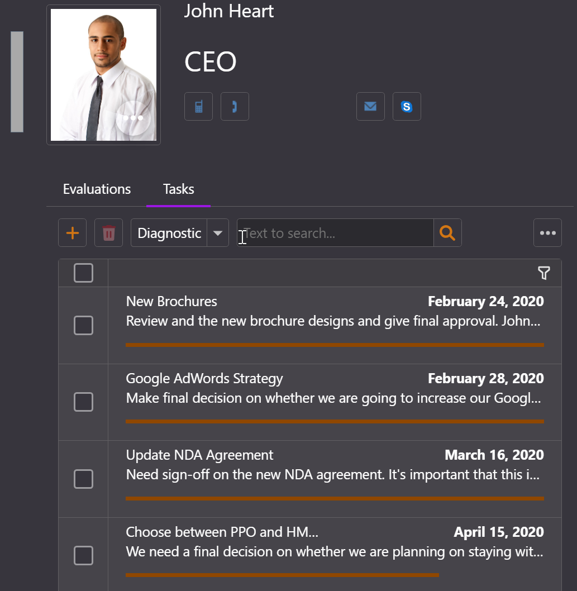
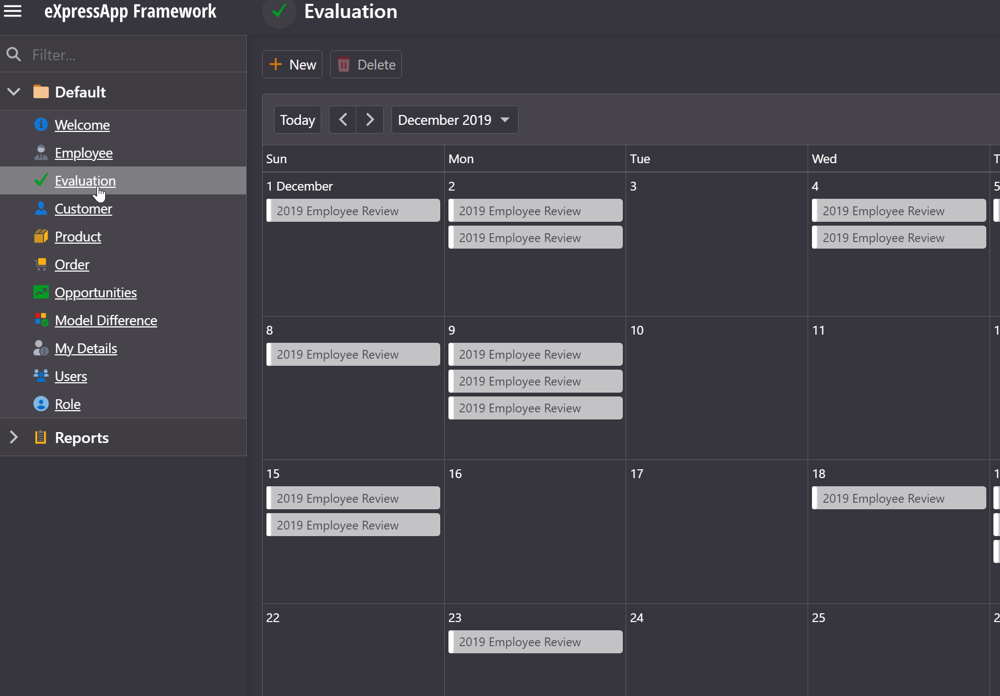
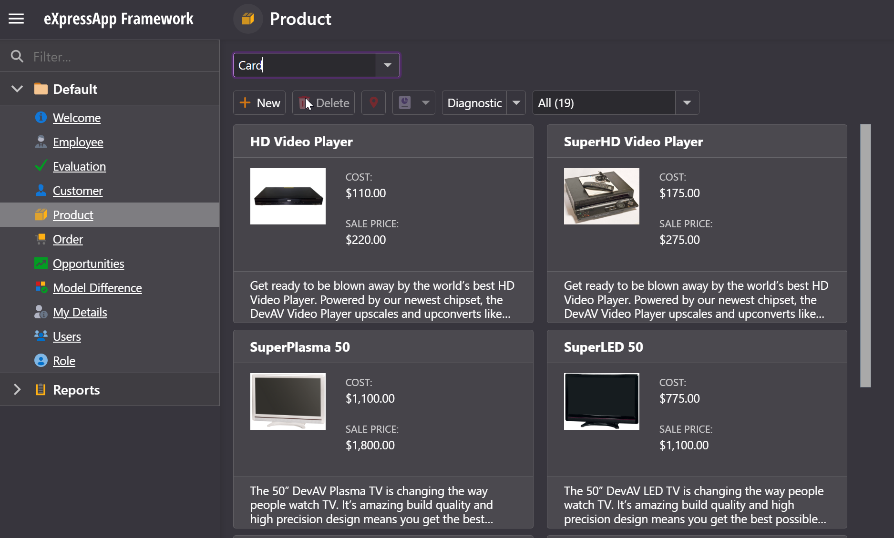

 
## Table of Contents
  - [Solution Overview](#solution-overview)
    - [Introduction](#introduction)
    - [Architecture](#architecture)
      - [Domain Diagram](#domain-diagram)
      - [Solution Structure](#solution-structure)
      - [OutlookInspired.Module Project](#outlookinspiredmodule-project)
        - [Services Folder](#services-folder)
        - [Attributes Folder](#attributes-folder)
        - [Controllers Folder](#controllers-folder)
        - [Features Folder](#features-folder)


# Solution Overview

## Introduction

Welcome to the OutlookInspired XAF application—a modern iteration of our original WinForms-based solution. This cross-platform **ERP/LOB** application is tailored for both Windows and Blazor, with plans for further platform expansion. It serves as the central data management hub for DevAv Company, overseeing various business entities such as Employees, Products, Orders, Quotes, Customers, and Stores.


## Architecture

### Domain Diagram

The domain architecture is depicted in the diagram below:


### Solution Structure

The solution consists of five distinct projects.


- **OutlookInspired.Module**: This is a platform-agnostic module on which all other projects rely.
- **OutlookInspired.Blazor.Server**: This is the Blazor platform port of the existing `OutlookInspired` WinForms demo.
- **OutlookInspired.Win**: This represents the Windows port of the original demo.
- **OutlookInspired.MiddleTier**: This serves as the MiddleTier layer and is exclusively used by the Windows platform.


#### `OutlookInspired.Module` project

Next, we describe the functionality found in each project folder.

##### `Services` Folder

This folder is pivotal, serving as the storage for our business logic. The aim is to keep all other classes lean, centralizing logic within this folder. For instance, methods that utilize `XafApplication` are located in `Services/XafApplicationExtensions`.

```cs
public static IObjectSpace NewObjectSpace(this XafApplication application) 
    => application.CreateObjectSpace(typeof(OutlookInspiredBaseObject));
```

Methods that use IObjectSpace can be found in Services/ObjectSpaceExtensions. For example:

```cs
public static TUser CurrentUser<TUser>(this IObjectSpace objectSpace) where TUser:ISecurityUser 
    => objectSpace.GetObjectByKey<TUser>(objectSpace.ServiceProvider.GetRequiredService<ISecurityStrategyBase>().UserId);
```
Take note of the SecurityExtensions class, where we configure a diverse set of permissions for each department. For instance, the Management department will have:

1. CRUD permissions for EmployeeTypes
2. Read-only permissions for CustomerTypes
3. Navigation permissions for Employees, Evaluations, and Customers
4. Mail merge permissions for orders and customers
5. Permissions for various reports including Revenue, Contacts, TopSalesMan, and Locations.

```cs
private static void AddManagementPermissions(this PermissionPolicyRole role) 
    => EmployeeTypes.AddCRUDAccess(role)
        .Concat(CustomerTypes.Prepend(typeof(ApplicationUser)).AddReadAccess(role)).To<string>()
        .Concat(new[]{ EmployeeListView,EvaluationListView,CustomerListView}.AddNavigationAccess(role))
        .Finally(() => {
            role.AddMailMergePermission(data => new[]{ MailMergeOrder, MailMergeOrderItem, ServiceExcellence }.Contains(data.Name));
            role.AddReportPermission(data => new[]{ RevenueReport, Contacts, LocationsReport, TopSalesPerson }.Contains(data.DisplayName));
        })
        .Enumerate();
```

##### `Attributes` Folder

In the `Attributes` folder, you'll find attribute declarations, the implementations of which reside in another library.

- `FontSizeDeltaAttribute`
  This attribute is applied to properties of `Customer`, `Employee`, `Evaluation`, `EmployeeTask`, `Order`, and `Product` to configure the font size. The implementation is context-dependent; for Windows, it is utilized from the `LabelPropertyEditor`.


  ```cs
   protected override object CreateControlCore() 
   => new LabelControl{
         BorderStyle = BorderStyles.NoBorder,
         AutoSizeMode = LabelAutoSizeMode.None,
         ShowLineShadow = false,
         Appearance ={
            FontSizeDelta = MemberInfo.FindAttribute<FontSizeDeltaAttribute>()?.Delta??0,
            TextOptions = { WordWrap =MemberInfo.Size==-1? WordWrap.Wrap:WordWrap.Default}
         }
   };
  ```

  also from the ListEditor `GridView`:

  ```cs
   public static void IncreaseFontSize(this GridView gridView, ITypeInfo typeInfo){
      var columns = typeInfo.AttributedMembers<FontSizeDeltaAttribute>().ToDictionary(
            attribute => gridView.Columns[attribute.memberInfo.BindingName].VisibleIndex,
            attribute => attribute.attribute.Delta);
      gridView.CustomDrawCell += (_, e) => {
            if (columns.TryGetValue(e.Column.VisibleIndex, out var column)) e.DrawCell( column);
      };
   }
  ```

  

  for Blazor it is implemented from an extension method:
  
  ```cs
    public static string FontSize(this IMemberInfo info){
        var fontSizeDeltaAttribute = info.FindAttribute<FontSizeDeltaAttribute>();
        return fontSizeDeltaAttribute != null ? $"font-size: {(fontSizeDeltaAttribute.Delta == 8 ? "1.8" : "1.2")}rem" : null;
    }
  ```

  and used similarly:
  
  

- ##### `Appearance` Subfolder

  The following [Conditional Appearance module](https://docs.devexpress.com/eXpressAppFramework/113286/conditional-appearance) attributes are located here:

  `DeactivateActionAttribute`: This is an extension of the [Conditional Appearance module](https://docs.devexpress.com/eXpressAppFramework/113286/conditional-appearance) used to deactivate actions.

  ```cs
  public class DeactivateActionAttribute : AppearanceAttribute {
      public DeactivateActionAttribute(params string[] actions) : 
          base($"Deactivate {string.Join(" ", actions)}", DevExpress.  ExpressApp.ConditionalAppearance.AppearanceItemType.Action, "1=1")   {
          Visibility = ViewItemVisibility.Hide;
          TargetItems = string.Join(";", actions);
      }
  }
  
  ```

  Similarly, we derive from this attribute to create the other attributes   found in the same folder (`ForbidCRUDAttribute`, `ForbidDeleteAttribute`,`ForbidDeleteAttribute`).

- ##### `Validation` Subfolder: In this folder, you can find attributes that extend the [XAF Validation module](https://docs.devexpress.com/eXpressAppFramework/113684/validation-module). Available are `EmailAddressAttribute`, `PhoneAttribute`, `UrlAttribute`, `ZipCodeAttribute`. Below is the latter, and the rest are implemented similarly.

  ```cs
  public class ZipCodeAttribute : RuleRegularExpressionAttribute {
      public ZipCodeAttribute() : base(@"^[0-9][0-9][0-9][0-9][0-9]$") {
          CustomMessageTemplate = "Not a valid ZIP code.";
      }
  }
  ```
##### `Controllers` Folder
In this folder we have controllers with no dependecies, they could reside in a different library if we wish.
* The `HideToolBarController`: extends the XAF IModelListView interface with a HideToolBar attribte so we can hide the nested listviews toolbare. 
* <a name="splitter"></a>The `SplitterPositionController`: extends the XAF model withe a `RelativePosition` so we can configure the splitter position.
##### `Features` Folder
This folder contains implementations specific to the solution.
- ##### `CloneView` Subfolder

  This subfolder contains the declaration for the `CloneViewAttribute`,   which is used to generate views in addition to the default ones. For   example:
  
  ```cs
  [CloneView(CloneViewType.DetailView, LayoutViewDetailView)]
  [CloneView(CloneViewType.DetailView, ChildDetailView)]
  [CloneView(CloneViewType.DetailView, MapsDetailView)]
  [VisibleInReports(true)]
  [ForbidDelete()]
  public class Employee : OutlookInspiredBaseObject, IViewFilter,   IObjectSpaceLink, IResource, ITravelModeMapsMarker {
      public const string MapsDetailView = "Employee_DetailView_Maps";
      public const string ChildDetailView = "Employee_DetailView_Child";
      public const string LayoutViewDetailView =   "EmployeeLayoutView_DetailView";
  }
- ##### `Customers` Subfolder
  This subfolder contains implementations related to customers, such as:

  - ###### `MailMergeController`
    XAF offers built-in support for [mail merging](https://docs.devexpress.com/eXpressAppFramework/400006/document-management/office-module/mail-merge). This controller modifies the default `ShowInDocumentAction` icons.

      

  - ###### `ReportsController`
    This controller declares an action for displaying Customer Reports, utilizing the [XAF Reports module](https://docs.devexpress.com/eXpressAppFramework/113591/shape-export-print-data/reports/reports-v2-module-overview) API.

      

- ##### `Employees` Subfolder
  This subfolder contains implementations related to Employees, such as:

  - ###### `RoutePointController`
    This controller sets the travel distance once calculated from the MAP service.

    Windows:
    

    Blazor:
    

- ##### `Employees` Subfolder

  This subfolder houses implementations related to map functionalities, including:

  <a name="mapsviewcontroller_"></a>
  - ###### `MapsViewController`

    This controller declares actions related to map features (`MapItAction`, `TravelModeAction`, `ExportMapAction`, `PrintPreviewMapAction`, `PrintAction`, `StageAction`, `SalesPeriodAction`) and manages their state based on the `ISalesMapMarker` and `IRoutePointMapMarker` interfaces.

- ##### `MasterDetail` Subfolder
  This subfolder houses a platform-agnostic Master-detail implementation using XAF's [DashboardViews](https://docs.devexpress.com/eXpressAppFramework/DevExpress.ExpressApp.DashboardView).

  - ###### `MasterDetailController, IUserControl`
    The `IUserControl` is implemented in a manner similar to the [XAF documentation](https://docs.devexpress.com/eXpressAppFramework/113610/ui-construction/using-a-custom-control-that-is-not-integrated-by-default/using-a-custom-control-that-is-not-integrated-by-default). The distinction lies in adding the UserControl (for Win) or the Component (for Blazor) to a DetailView. With the aid of `IUserControl`, which derives from `ISelectionContext, IComplexControl`, it becomes possible to exhibit view-like behavior. Additionally, XAF actions for the object type function as expected, as they are bound to the view.


- ##### `Orders` Subfolder
  This subfolder focuses on implementations related to sales activities.

  - ###### `FollowUpController`
    Declares an action to display the follow-up mail merge template for the selected order.
    
    

  - ###### `InvoiceController`
    Utilizes a master-detail mail merge template pair to generate an invoice, converts it to a PDF, and displays it using the `PdfViewEditor`.
  
  - ###### `Pay/Refund Controllers`
    These controllers declare actions to mark the selected order as either Paid or Refunded.
  
  - ###### `ReportController`
    Provides access to reports related to Order Revenue.

    

  - ###### `ShipmentDetailController`
    Adds a watermark to the Shipment Report based on the order status.

    
    

- ##### `Products` Subfolder
  This subfolder focuses on implementations related to Products.

  - ###### `ReportsController`
    Declares an action to display report for Sales, Shipments, Comparisons, Top Sales Person .
  
    
  

- ##### `Quotes` Subfolder
  This subfolder focuses on implementations related to Products.

  - ###### `QuoteMapItemController`
    Calculates the QuoteMapItem non-persistent objects used from the Opportunities view
  
    

- ##### `ViewFilter` Subfolder
  This subfolder has a Filter manager implementation which can be used from the end user to create and save view filters.
  
  
  

#### `OutlookInspired.Win` project
This is the Windows frontend project. It utilizes the previously mentioned agnostic `OutlookInspired.Module` and adheres to the same architectural folder structure.

Next, we describe the functionality found in each project folder.

##### `Controllers` Folder
In this folder, we house controllers that have no dependencies. If desired, they could be relocated to a different library.

- `DisableSkinsController`: This controller disables the XAF default theme-switching action. We strive for consistency in this demo across multiple platforms. Testing our views in each supported skin would require significant resources.

- **`SplitterPositionController`**: This is the Windows implementation of the [SplitterPositionController](#splitter). We discussed its platform agnostic counterpart in the `OutlookInspired.Module`.


##### `Editors` Folder
In this folder, we house custom user controls and XAF [property editors](https://docs.devexpress.com/eXpressAppFramework/113097/ui-construction/view-items-and-property-editors/property-editors).

- `ColumnViewUserControl`: This is a base user control that implements the [IUserControl](#masterdetailcontroller-iusercontrol) discussed previously and has view-like behavior.

- `EnumPropertyEditor`: This is a subclass of the built-in EnumPropertyEditor, with the difference that it displays only the image.
   
   

- `HyperLinkPropertyEditor`: This editor displays hyperlinks with mailto support.

   

- `LabelControlPropertyEditor`: This is an editor that renders a label.

  

- `PdfViewerEditor`: This is a PDF viewer using the [pdfviewer](https://docs.devexpress.com/WindowsForms/15216/controls-and-libraries/pdf-viewer) component.

  

- `PrintLayoutRichTextEditor`: This editor extends the built-in RichTextPropertyEditor, but uses the PrintLayout mode.

- `ProgressPropertyEditor`: This editor is used to display progress in various contexts.

  

##### `Services` Folder

Similarly to the agnostic [Services Folder](#services-folder) we keep all classes as thin as possible and we write the bussiness logig in extension methods.

##### `Features` Folder

This folder contains implementations specific to the solution.

- ##### Maps Subfolder

  This subfolder contains functionality related to maps.

  - **MapsViewController**: This controller overrides the platform-agnostic MapsViewController to further configure the state of map actions.
  
  - **WinMapsViewController**: This is an abstract controller that provides functionality used by its derived classes, `SalesMapsViewController` and `RouteMapsViewController`. It configures Map views for all objects that implement the `ISalesMapsMarker` (Customer, Product) and `IRouteMapsMarker` (Order, Employee) interfaces.
  
  
  
  

- ##### Customers Subfolder

  This subfolder contains functionality related to customers.

  - **CustomerGridView**, **CustomerLayoutView**, and **CustomerStoreView**: These classes derive from the previously discussed `ColumnViewUserControl` and exhibit view-like behavior. They host custom GridControl variants, such as master-detail layouts.
  
  

- ##### Employees Subfolder

  This subfolder contains functionality related to employees.

  - **EmployeesLayoutView**: This is a descendant of `ColumnViewUserControl` that hosts a GridControl LayoutView.

  

- ##### GridListEditor Subfolder

  This subfolder contains functionality related to default XAF GridListEditor.

  - `FontSizeController`: Uses the `FontSizeDelta` discussed in the agnostic method to increase the font size in a row cell of an AdvancedBanded Grid

  - `NewItemRowHandlingModeController`: Modifies how new object are handled when a dashboard master detailview (discussed in the agnostic module) objects are created.

- ##### Products Subfolder

  This subfolder contains functionality related to employees.
  
  - `ProductCardView`: This is a descendant of `ColumnViewUserControl` that hosts a GridControl LayoutView.

    

- ##### Quotes Subfolder

  This subfolder contains functionality related to opportunities.

  - `WinMapsController`, `PaletteEntriesController`: Configures the opportunities maps view.

      

  - `FunnelFilterController`, `PropertyEditorController`: The first filters the Funnel chart when the FilterManager discussed in the agnostic section is executed. The later assigns a progress to the Pivot cell.

    

    
## OutlookInspired.Blazor.Server Project
This is the Blazor frontend project that utilizes the agnostic `OutlookInspired.Module`. It adheres to the same architectural folder structure.

### Components Folder
This folder contains Blazor components essential for meeting the project's requirements. These components are self-contained and can be easily moved to another library.

- **ComponentBase, ComponentModelBase**: `ComponentBase` is the foundational component for client-side components like DxMap, DxFunnel, DXPivot, and PdfViewer. It manages the loading of resources such as JavaScript files. `ComponentModelBase` acts as the base model for all components, offering functionalities like a `ClientReady` event and a hook for browser console messages, among other features.

  

- **HyperLink, Label**: These components function similarly to their Windows counterparts and are used to render hyperlinks and labels.

  

- **PdfViewer**: This is a descendant of `ComponentBase` and serves as a viewer for PDF files.

  

- **XafImg, BOImage**: Both components know how to display images in a variety of contexts.

  
  

- **XafChart**: This component is utilized for charting Customer stores.

  

- ##### `CardView` Subfolder
  
  This folder contains the the `SideBySideCardView` and the `StackedCardView`. They are used to display Card like listviews like bellow.

  

- ##### `DevExtreme` Subfolder

  In this folder we have .NET reusabe compoenents that utilizing the [Map](https://js.devexpress.com/jQuery/Demos/WidgetsGallery/Demo/Map/Markers/Light/), [VectorMap](https://js.devexpress.com/jQuery/Demos/WidgetsGallery/Demo/VectorMap/Overview/Light/), [Funnel](https://js.devexpress.com/jQuery/Demos/WidgetsGallery/Demo/Charts/FunnelChart/Light/) and [Chart](https://js.devexpress.com/jQuery/Demos/WidgetsGallery/Demo/Charts/Overview/Light/) DevExtreme Widgets.


### Controllers Folder
This folder similarly to the agnostic and windows project contains controllers that have no dependecies to this solution.

- `CellDisplayTemplateController`: Is an abstract controller that allows us to render the GridListEditor row cell fragments.
- `DxGridListEditorController`: Overiddes GridListEditor behaviours such as removing command columns.
- `PopupWindowSizeController`: Configures the size of our popup windows.

### Editors Folder
This folder houses XAF custom yet reusable editors. They are not dependent on the OutlookInspired demo. Examples include:

- **ChartListEditor**: An abstract list editor designed to aid in creating simple object-specific variants.
  
  ```csharp
  [ListEditor(typeof(MapItem), true)]
  public class MapItemChartListEditor : ChartListEditor<MapItem, string, decimal, string, XafChart<MapItem, string, decimal, string>> {
      public MapItemChartListEditor(IModelListView info) : base(info) {
      }
  }

- `ComponentPropertyEditor`: An abstract property editor that can be utilized to craft concrete editors like `ProgressPropertyEditor` or `PdfViewEditor`. The latter makes use of the PdfViewer component from the Components folder.

  ```cs
  [PropertyEditor(typeof(byte[]), EditorAliases.PdfViewerEditor)]
  public class PdfViewerEditor : ComponentPropertyEditor<PdfModel, PdfModelAdapter, byte[]> {
      public PdfViewerEditor(Type objectType, IModelMemberViewItem model) : base(objectType, model) {
      }
  }

  ```
- `EnumPropertyEditor`: Inherits from XAF's native EnumPropertyEditor, but solely displays the image, akin to its Windows counterpart.

`DisplayTestPropertyEditors`: Displays raw text, similar to the Windows LabelPropertyEditor.

### Editors Folder
Within this directory, you'll find implementations tailored to the solution.

- ##### `Customers` subfolder
  Here using components from the previously discussed `Compoenents` folder we bind them to Customer data. For example we use the `StackedCardView` with a `StackedInfoCard` like:

  ```cs
  <StackedCardView>
    <Content>
        @foreach (var store in ComponentModel.Stores){
            <StackedInfoCard Body="@store.City" Image="@store.Crest.LargeImage.ToBase64Image()"/>
        }
    </Content>
 </StackedCardView>
  ```

  The visual output is as follows:

  

  
- ##### `Employees` subfolder
  
  In a manner akin to the customers, this section demonstrates how the `StackedCardView` from the Components folder is paired with a `SideBySideInfoCard`.

  ```cs
  <StackedCardView >
    <Content>
        @foreach (var employee in ComponentModel.Objects){
            <SideBySideInfoCard CurrentObject="employee" ComponentModel="@ComponentModel" Image="@employee.Picture?.Data?.ToBase64Image()" HeaderText="@employee.FullName" 
                                InfoItems="@(new Dictionary<string, string>{{ "ADDRESS", employee.Address },
                                               { "EMAIL", $"<a href=\"mailto:{employee.Email}\">{employee.Email}</a>" },{ "PHONE", employee.HomePhone } })"/>
        }
    </Content>
</StackedCardView>
  ```

  The final visual representation is:

  

  Within the `Evaluations` and `Tasks` subfolders, components can be found that are responsible for rendering the cell fragment in the image below. Both are linked to the cell via the `Controllers\CellDisplayTemplateController`.

  

- ##### `Evaluations` subfolder
  The `SchedulerGroupTypeController` plays a role in setting up the scheduler, as depicted below:

  

- ##### `Maps` subfolder
  Mirroring its Windows counterpart, this subfolder houses both the `RouteMapsViewController` and the `SalesMapsViewController`. These controllers are responsible for configuring the maps `ModalDxMap` and `ModalDxVectorMap` along with their associated actions such as `TravelMode`, `SalesPeriod`, `Print`, and more. The components within this directory are fragments that employ those found in `Components/DevExtreme`. Additionally, they adjust the height as they are displayed in a modal popup window.
 
- ##### `Orders` subfolder
  The `DetailRow` component renders the detail fragment for the OrderListView.

  

- ##### `Product` subfolder
  Similar to the Employees subfolder, a `Component/CardViews/StackedCardView` declaration is found here:

  ```xml
  <StackedCardView>
    <Content>
        @foreach (var product in ComponentModel.Objects) {
             <SideBySideInfoCard CurrentObject="product" ComponentModel="@ComponentModel" Image="@product.PrimaryImage.Data.ToBase64Image()" HeaderText="@product.Name" 
                                 InfoItems="@(new Dictionary<string, string>{{ "COST", product.Cost.ToString("C") },
                                                { "SALE PRICE", product.SalePrice.ToString("C") } })"
                                 FooterText="@product.Description.ToDocument(server => server.Text)"/>
         }

    </Content>
  </StackedCardView>
  ```

  and the result view for this looks like:

  

# Importing
  The importing process is initiated from the [ImportData/test](Tests/OutlookInspired.Win.Tests/Import/ImportData.cs) test; more details about this will be covered in the subsequent section. Here's the technique we adopted:

  Our legacy database utilizes SQLite and has a long key. In contrast, this demo is built on SQL Server, which employs a GUID key. To match the objects without overwhelming the memory, we incorporated an additional long property into the base object of this demo.

   ```cs
       public abstract class OutlookInspiredBaseObject:BaseObject{
        [Browsable(false)]
        public virtual long IdInt64{ get; set; }
   ```

  The next method is used to do the SqlLite-SqlServer objects matching.

  ```cs
  private static T FindSqlLiteObject<T>(this IObjectSpace objectSpace, long? id) where T : OutlookInspiredBaseObject 
            => objectSpace.FindObject<T>(migrationBaseObject => id == migrationBaseObject.IdInt64);
  ```

 In the test we first create a new instance and we setup a OutlookInspiredWindowsFormApplication then we create ObjectSpace and we call the `ImportFromSqlLite` demo. Similar to everything already discussed tests are no different so all logic lives in extension methods making our tests easy to read and maintain.

 The ImportFromSqlLite method now has a connection to the new SqlServer database with the objectspace and we open one to the SqlLite with the legacy DBContext.

 ```cs
 public static IObservable<Unit> ImportFromSqlLite(this IObjectSpace objectSpace) 
            => new DevAvDb($"Data Source={AppDomain.CurrentDomain.DBPath()}").Use(objectSpace.ImportFrom);
 ```

 To write the actual importing we first start with the zero-dependecies objects and then move downward the chain while we commit each level first. This is done with the `CommitAndConcat` method and we follow the [domain diagram](#domain-diagram) on the top of this wiki

 ```cs
 static IObservable<Unit> CommitAndConcat(this IObservable<Unit> source, IObjectSpace objectSpace, Func<IObservable<Unit>> nextSource)
            => source.DoOnComplete(objectSpace.CommitChanges).ConcatDefer(nextSource);
 ```

First we import the `Crest`, `State`, `Customer`, `Picture`, `Probation` objects.

```cs
private static IObservable<Unit> ZeroDependencies(this IObjectSpace objectSpace, DevAvDb sqliteContext)
    => objectSpace.ImportCrest(sqliteContext)
        .Merge(objectSpace.ImportState(sqliteContext))
        .Merge(objectSpace.ImportCustomer(sqliteContext))
        .Merge(objectSpace.ImportPicture(sqliteContext))
        .Merge(objectSpace.ImportProbation(sqliteContext));

```
and when finishing with all levels we end up with this method.

```cs
static IObservable<Unit> ImportFrom(this IObjectSpace objectSpace, DevAvDb sqliteContext) 
    => objectSpace.ZeroDependencies(sqliteContext)
        .CommitAndConcat(objectSpace, () => objectSpace.ImportCustomerStore(sqliteContext)
            .Merge(objectSpace.ImportEmployee(sqliteContext)
                .CommitAndConcat(objectSpace, () => objectSpace.EmployeeDependent(sqliteContext, objectSpace.ProductDependent(sqliteContext))))
            .CommitAndConcat(objectSpace, () => objectSpace.CustomerStoreDependent(sqliteContext, objectSpace.CustomerEmployeeDependent(sqliteContext))))
        .Finally(objectSpace.CommitChanges);

```

# Continuous Integration

  The demo is accompanied with the [azure-pipelines.yml](azure-pipelines.yml). The yml configfuration is a complete CI/CD pipeline responsible for building and testing in the AzDevops cloud. Two jobs are used to run the `600+ tests` for `Windows` and `Blazor`
